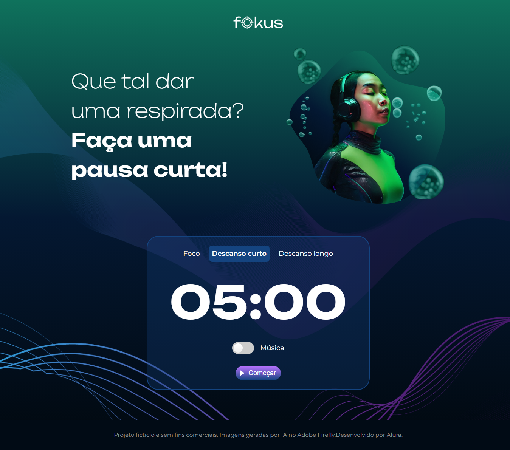

<h1 align="center">⏳ Fokus ⏳</h1>

<h3 align="center">O projeto Fokus foi desenvolvido no curso de JavaScript: manipulando elementos no DOM na formação: Desenvolva aplicações Web com JavaScript, da Alura.</h3>

 

  

## Tópicos

- [Imagem do projeto](#img)
- [Acesso ao projeto](#acesso)
- [Descrição do projeto](#desc)
- [Tecnologias utilizadas](#tec)
- [Status do projeto](#status)
- [Licença](#license)

 

<h2 id="img">⏰ Imagem do projeto</h2>

    

 

<h2 id="acesso">🔗 Acesso ao projeto</h2>

Clique [aqui](https://fel1324.github.io/Fokus/) para acessar o projeto.

 

<h2 id="desc">⏲ Descrição do projeto</h2>

    O Fokus é um site que ajuda você a se concentrar em suas atividades, estabelecendo um tempo para o foco, outro para um descanso curto e outro para um descanso longo. O Fokus é baseado na Técnica de Pomodoro.

 

<h2 id="tec">🔥 Tecnologias utilizadas</h2>

* HTML e CSS
* Javascript
* Git e Github
* Figma

 

<h2 id="status">🚧 Status do projeto</h2>

✔️ Projeto Finalizado :)

 

<h2 id="license">📝 Licença</h2>

Esse projeto está sob a licença MIT.